# ILLINOIS TECH AIRWAYS

Illinois Tech airways application is offering by airways where one can book flights & fly with Illinois Tech airways. Receive exclusive air fares through this application.

As of now, Illinois Tech airways is provided its’ services from Chicago to Orlando, New York, Seattle and Dallas from 10th May 2020 to 14th May. We are really looking forward to extend our services.

**Features:**
*	SignUp by customer.
*	Login by customer and admin.
*	Update their profile by customer and admin.
*	Create a new user of type customer or admin by admin.
*	Search for the flights and book a ticket by customer and admin.
*	View history of tickets by customer and admin. Admin can view history of all customers whereas customer can view only his own
*	Cancel a ticket by admin.

## Home View

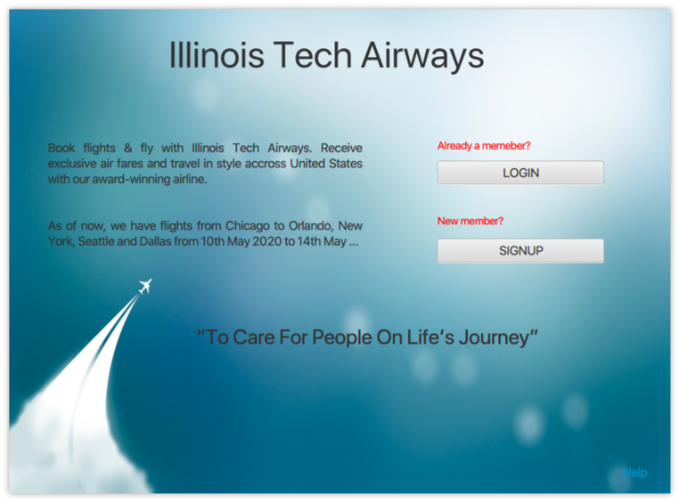
From Home, user can able to signUp to the application, if he is new member and login, if the user is already a member of airways.

## SignUp

User can sign up to the application by providing required details.

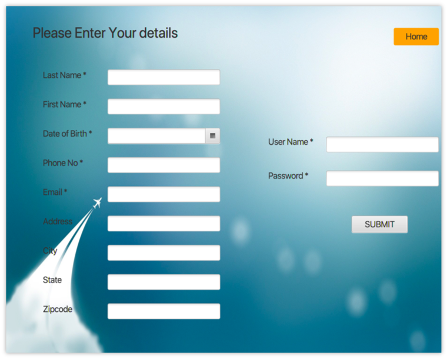

Once the user submits the details, he will be added as a member to the application.

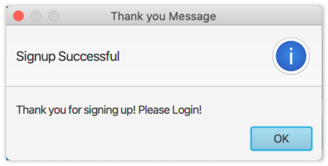

## Login

Once the user signed up, he will be able to login to the application with his credentials through login screen.

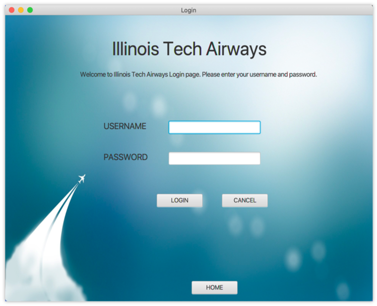

On successful login of user, a welcome message will be displayed.

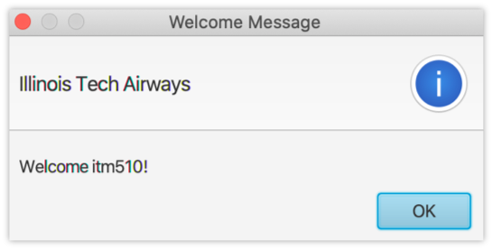

## Customer View

From customer view, customer can view or update his profile, search for the flights and view his ticket booking history.

### VIEW PROFILE
Customer can view whether the information is correct or not. If not, he can update the details.

### Book Ticket
Customer can search for the availability of the flights (for particular destinations, date and class). 
If the flights are available for a specific search, the flight details will be displayed. If not, an alert will be displayed with message “No flights available for the search.”

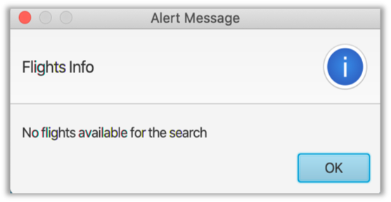

If flights and seats are available for the search.

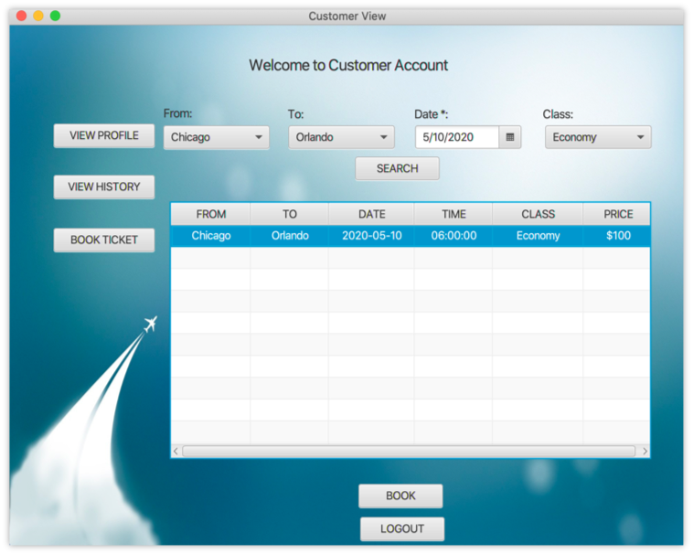

After finding the ticket availability, customer can double click on the desired flight and book a ticket by providing payment details. (enter any numbers as card number).

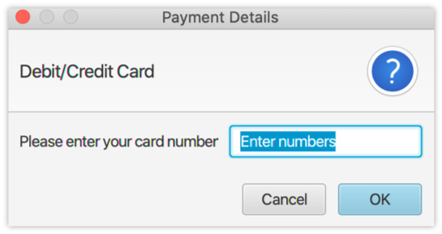

### View History
Customer can view his ticket booking history in this pane.
If the customer has ticket history, booked tickets will be displayed. If not, an alert will be displayed with a message ‘No Ticket History’.

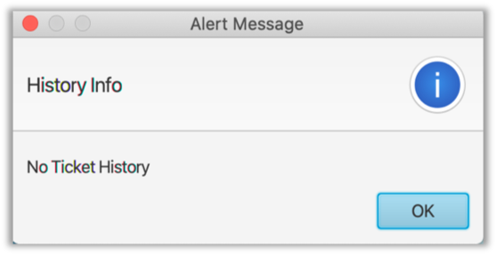

If the booking history is available for the customer.

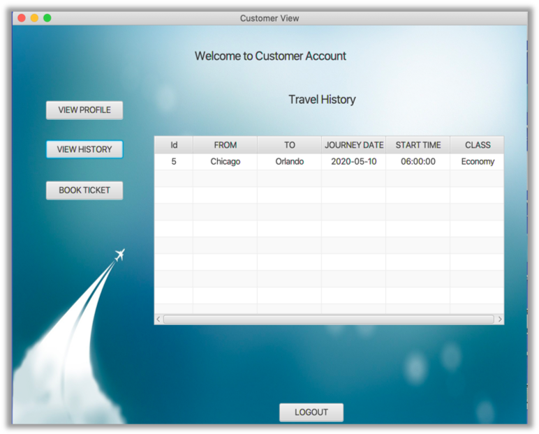

## Ticket Details

After providing payment details, ticket will be booked, and customer can view his recently booked ticket details in the Ticket Details screen as below.
On clicking View Ticket button, Ticket Details will be displayed which includes BookingID and travel details along with basic details of the customer.

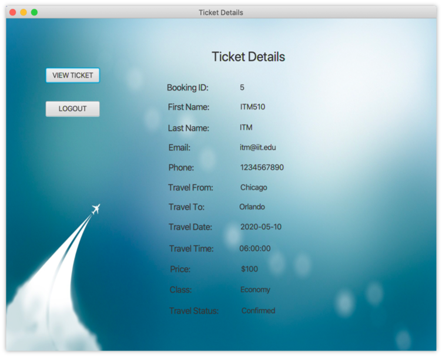

Logout button is available on very screen, which allows the user to logout from the application at any point of time. On clicking Logout button, a Thank you message will be displayed, and user will be logged out from the application and the display is directed to home page.

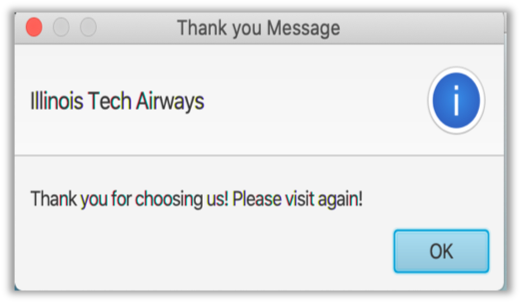

## Admin View

Admin view will be similar to the customer view, with some more privileges.

### View Profile
As a customer, admin can view his profile and update the details, if needed.

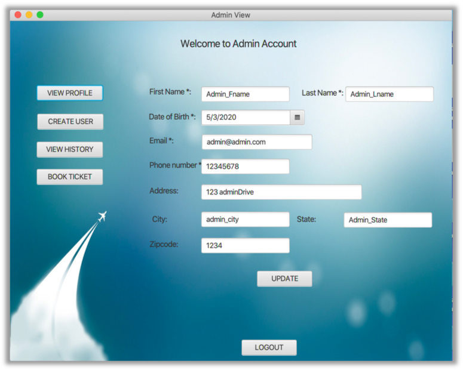

### Create User

Admin can create a new user to the application. He can have privilege to add both customer and admin. 
On providing the necessary details and clicking on create button, new user will be created to the application by admin.

If the user type is customer, the new member will be a customer.
If the user type is admin, the new member will be a admin.

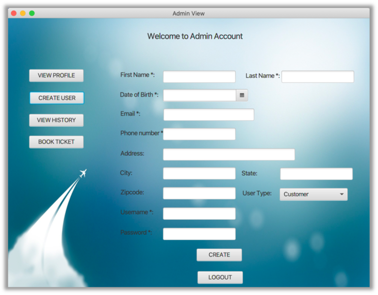

### Book Ticket
Book Ticket pane operation will be similar as for customer.

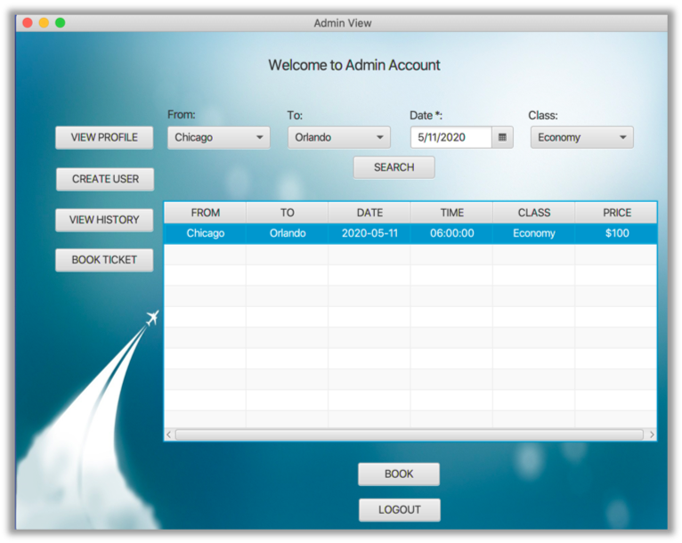

If the flights are available for the specific search, the flight details will be shown in table format.
On double clicking the available flight, Book button will be enabled. 
After Clicking Book button and providing payment details, ticket will be booked and displays the Ticket Details screen.
On clicking View Button in Ticket details screen, the recently booked ticket details will be shown.

### View History

View History pane of admin will display the history of booked tickets by all the users of the application. Admin will also have a privilege to delete a booked ticket. On double clicking the desired ticket, the delete button will be enabled. 

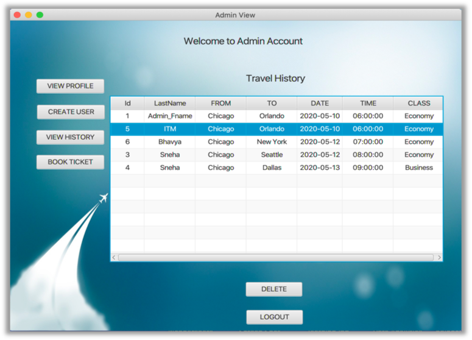

On clicking delete button, the specified ticket will be deleted, and an alert message will be displayed as below.

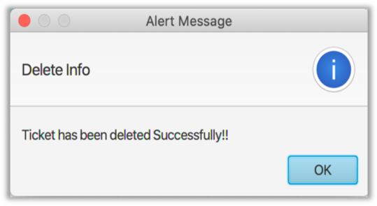

